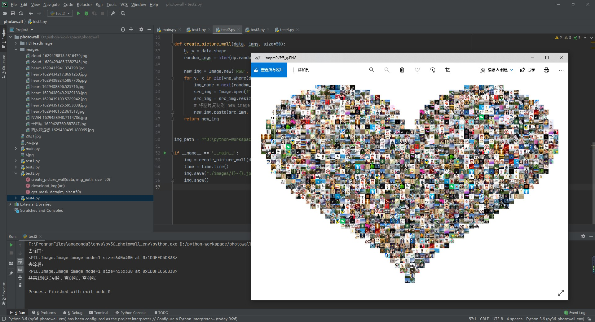

# photowall
照片墙：本地图片集生成。

语言：python3.6

微词云网站：https://www.weiciyun.com/edit

==============================================================

(base) C:\Users\DELL>conda activate py36_photowall_env

(py36_photowall_env) C:\Users\DELL>pip list
Package            Version
------------------ -------------------
absl-py            0.13.0
astunparse         1.6.3
certifi            2021.5.30
charset-normalizer 2.0.4
cycler             0.10.0
flatbuffers        1.12
google-pasta       0.2.0
idna               3.2
keras-nightly      2.5.0.dev2021032900
kiwisolver         1.3.1
matplotlib         3.3.4
numpy              1.19.5
object-detection   0.1
Pillow             8.3.1
pip                21.0.1
pyparsing          2.4.7
python-dateutil    2.8.2
requests           2.26.0
setuptools         52.0.0.post20210125
six                1.16.0
typing-extensions  3.7.4.3
urllib3            1.26.6
wheel              0.37.0
wincertstore       0.2

(py36_photowall_env) C:\Users\DELL>

============================================================

